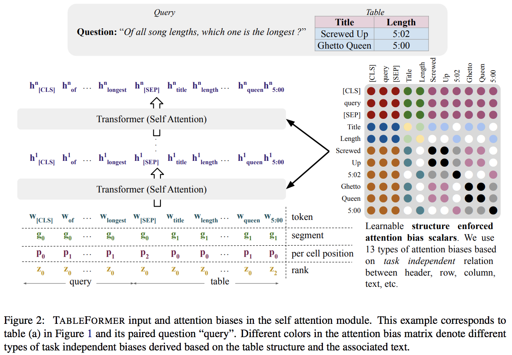

</img>

## Tableformer - Pytorch (wip)

Implementation of <a href="https://arxiv.org/abs/2203.00274">TableFormer, Robust Transformer Modeling for Table-Text Encoding</a>, in Pytorch. The claim of this paper is that through attentional biases, they can make transformers more robust to perturbations to the table in question. They show improved results compared to <a href="https://arxiv.org/abs/2004.02349">TAPAS</a>

## Citations

```bibtex
@article{Yang2022TableFormerRT,
  title   = {TableFormer: Robust Transformer Modeling for Table-Text Encoding},
  author  = {Jingfeng Yang and Aditya Gupta and Shyam Upadhyay and Luheng He and Rahul Goel and Shachi Paul},
  journal = {ArXiv},
  year    = {2022},
  volume = {abs/2203.00274}
}
```
